# IDN-TensorFlow

------

## Introduction

This repository is TensorFlow implementation of IDN(CVPR16). 

You can see more details from paper and author's project repository

- Github : [[IDN-Caffe]](https://github.com/Zheng222/IDN-Caffe)
- Paper : ["Fast and Accurate Single Image Super-Resolution via Information Distillation Network"](<http://openaccess.thecvf.com/content_cvpr_2018/papers/Hui_Fast_and_Accurate_CVPR_2018_paper.pdf>)

------

## Network Structure

> IDN-TensorFlow/model/network.py

- **FBlock : Feqture extraction block**

  

- **DBlock : Information Distillation block**

  - Consists of **Enhancement unit** and **Compression unit**

    

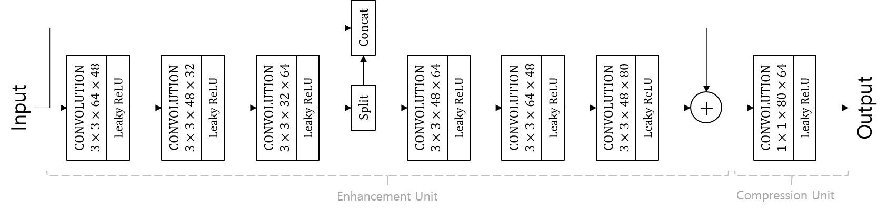

- **RBlock : Reconstruction block**

  - De-convolution

    

- LR denotes Low Resolution image
- SR denotes reconstructed super resolution image

------

## Training

### Loss Function

> \_loss_function(self, reg_parameter) in IDN-TensorFlow/model/\_\__init\_\_.py

- Pre-training stage : L2 loss

- Fine tuning stage : L1 loss

- Regularization

  - L2 regularization

  

  

- Notations

  -  : Weights in IDN
  -  : ground truth (original high resolution image, HR)
  -  : interpolated low resolution image (ILR)
  -  : reconstructed super resolution image
  -  : residual between HR and ILR
    - 
  -  : regularization parameter
    -  : 0.0001

### Optimization

> \_optimization_function(self, grad_clip, momentum_rate) in IDN-TensorFlow/model/\_\__init\_\_.py

- Optimization Method 

  - ADAM method [[paper]](<https://arxiv.org/pdf/1412.6980.pdf>)

- Weight Initialization

  - He initialization [[paper]](<https://www.cv-foundation.org/openaccess/content_iccv_2015/papers/He_Delving_Deep_into_ICCV_2015_paper.pdf>)

- **Learning Rate**

  - Initial Learning rate : 1e-4

- **Learning Rate Decay**

  - Learning rate decay is applied in tine tuning stage

  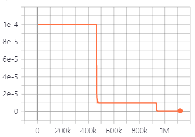

  - Learning rate is decreased by factor of 10 for every 250 epochs

- Epochs 

  - Pre-training stage: 100
  - Fine tuning stage : 600

------

## Data Set

### Training Data

> IDN-TensorFlow/data/generate_dataset/train_data.m

- 291 images
  - Download from Author's Repository
- Data Augmentations (Rotation, flip) were used
- Scale Factor : , , 

- Patch size 

| scale | Pre-Training (LR / GT) | Fine Tuning (LR / GT) |
| ----- | ---------------------- | --------------------- |
| 2     | 29 / 58                | 39 / 78               |
| 3     | 15 / 45                | 26 / 78               |
| 4     | 11 / 44                | 19 / 76               |

- Batch size : 64

### Testing Data

> IDN-TensorFlow/data/generate_dataset/test_data.m

- Set5, Set14, B100, Urban100
  - Download from Author's page [[zip(test)]](https://cv.snu.ac.kr/research/VDSR/test_data.zip)
- Bicubic interpolation is used for LR data acquisition
- Scale Factor : , , 

------

## Results

### Validation

PSNR performance plot on Set5

- Scale 2

  | 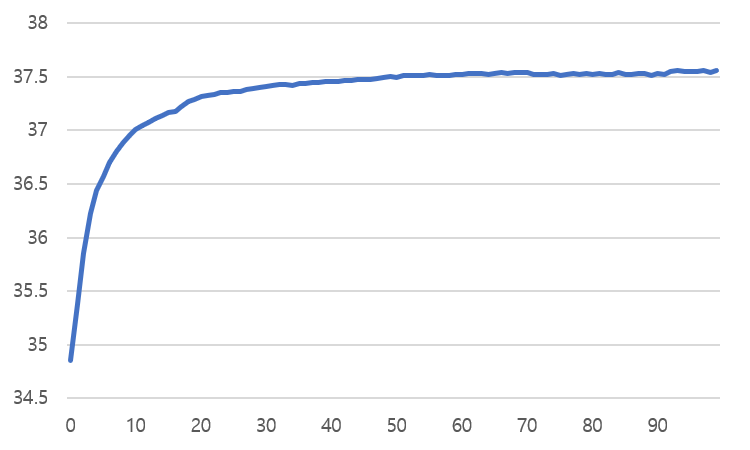 | 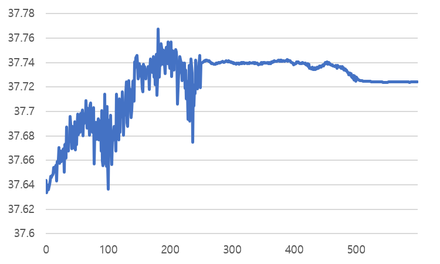 |
  | ----------------------------------------------------- | -------------------------------------------------------- |
  | Pre-training                                          | Fine Tuning                                              |

  

- Scale 3

  | 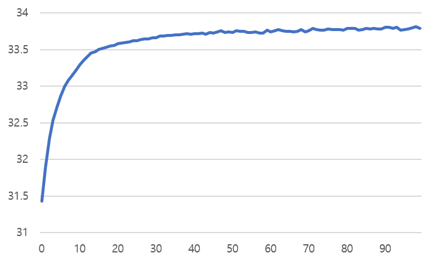 | 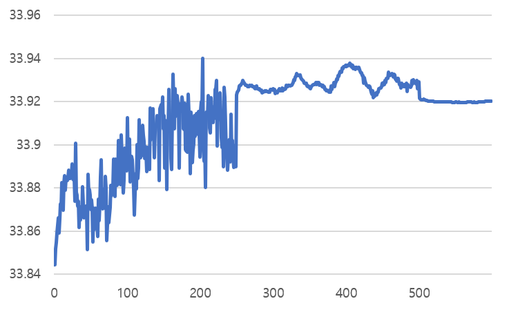 |
  | ------------------------------------------------------ | -------------------------------------------------------- |
  | Pre-training                                           | Fine Tuning                                              |

  

- Scale 4

  | 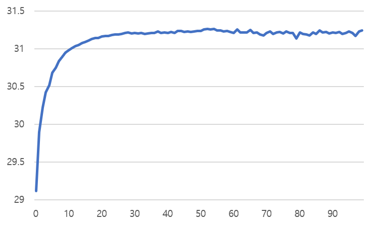 | 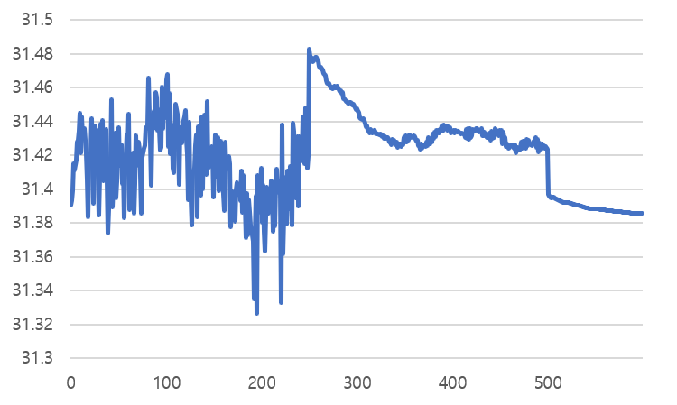 |
  | ------------------------------------------------------ | -------------------------------------------------------- |
  | Pre-training                                           | Fine Tuning                                              |

  

### Objective Quality Assessment

#### Methods

- Bicubic Interpolation 
  - imresize(..., ..., 'bicubic') in Matlab
- IDN(Original)
  - Author's Caffe implementation [[Code]](https://github.com/Zheng222/IDN-Caffe)
- IDN (TensorFlow)
  - TensorFlow implementation
  - Train Details for Comparison
    - Data Augmentation
      - Rotation : 90°, 180°, 270°
      - Flip : left / right
      - Down scale : 0.9, 0.8, 0.7, 0.6

#### Average PSNR/SSIM

- **Set5**
- Pre-Training

| scale                                                        | Bicubic        | IDN (Original) | IDN (TensorFlow) |
| ------------------------------------------------------------ | -------------- | -------------- | ---------------- |
|  | 33.68 / 0.9304 | 37.83 / 0.9600 | 37.56 / 0.9592   |
|  | 30.40 / 0.8682 | 34.11 / 0.9253 | 33.79 / 0.9213   |
|  | 28.43 / 0.8104 | 31.82 / 0.8903 | 31.24 / 0.8797   |

- Fine Tuning

| scale                                                        | Bicubic        | IDN (Original) | IDN (TensorFlow) |
| ------------------------------------------------------------ | -------------- | -------------- | ---------------- |
|  | 33.68 / 0.9304 | 37.83 / 0.9600 | 37.72 / 0.9600   |
|  | 30.40 / 0.8682 | 34.11 / 0.9253 | 33.92 / 0.9233   |
|  | 28.43 / 0.8104 | 31.82 / 0.8903 | 31.39 / 0.8846   |

---

- **Set14**
- Pre-Training

| scale                                                        | Bicubic        | IDN (Original) | IDN (TensorFlow) |
| ------------------------------------------------------------ | -------------- | -------------- | ---------------- |
|  | 30.24 / 0.8693 | 33.30 / 0.9148 | 33.11 / 0.9136   |
|  | 27.54 / 0.7746 | 29.99 / 0.8354 | 29.68 / 0.8312   |
|  | 26.00 / 0.7029 | 28.25 / 0.7730 | 27.92 / 0.7664   |

- Fine Tuning

| scale                                                        | Bicubic        | IDN (Original) | IDN (TensorFlow) |
| ------------------------------------------------------------ | -------------- | -------------- | ---------------- |
|  | 30.24 / 0.8693 | 33.30 / 0.9148 | 33.14 / 0.9142   |
|  | 27.54 / 0.7746 | 29.99 / 0.8354 | 29.71 / 0.8313   |
|  | 26.00 / 0.7029 | 28.25 / 0.7730 | 27.93 / 0.7679   |

---

- **B100**
- Pre-Training

| scale                                                        | Bicubic        | IDN (Original) | IDN (TensorFlow) |
| ------------------------------------------------------------ | -------------- | -------------- | ---------------- |
|  | 29.56 / 0.8442 | 32.08 / 0.8985 | 31.94 / 0.8974   |
|  | 27.21 / 0.7401 | 28.95 / 0.8013 | 28.75 / 0.7978   |
|  | 25.96 / 0.6697 | 27.41 / 0.7297 | 27.20 / 0.7248   |

- Fine Tuning

| scale                                                        | Bicubic        | IDN (Original) | IDN (TensorFlow) |
| ------------------------------------------------------------ | -------------- | -------------- | ---------------- |
|  | 29.56 / 0.8442 | 32.08 / 0.8985 | 31.99 / 0.8982   |
|  | 27.21 / 0.7401 | 28.95 / 0.8013 | 28.78 / 0.7988   |
|  | 25.96 / 0.6697 | 27.41 / 0.7297 | 27.17 / 0.7257   |

---

- **Urban100**
- Pre-Training

| scale                                                        | Bicubic        | IDN (Original) | IDN (TensorFlow) |
| ------------------------------------------------------------ | -------------- | -------------- | ---------------- |
|  | 26.88 / 0.8410 | 31.27 / 0.9196 | 30.82 / 0.9157   |
|  | 24.46 / 0.7358 | 27.42 / 0.8359 | 26.85 / 0.8240   |
|  | 23.14 / 0.6588 | 25.41 / 0.7632 | 24.90 / 0.7467   |

- Fine Tuning

| scale                                                        | Bicubic        | IDN (Original) | IDN (TensorFlow) |
| ------------------------------------------------------------ | -------------- | -------------- | ---------------- |
|  | 26.88 / 0.8410 | 31.27 / 0.9196 | 30.96 / 0.9173   |
|  | 24.46 / 0.7358 | 27.42 / 0.8359 | 26.95 / 0.8271   |
|  | 23.14 / 0.6588 | 25.41 / 0.7632 | 24.89 / 0.7500   |

------

### Visual Quality

- "img002" of Urban100 for scale 2

| Ground Truth                                               | Bicubic                                                      | IDN (TensorFlow) Pre-train                                   | IDN (TensorFlow) Fine Tuning                                 |
| ---------------------------------------------------------- | ------------------------------------------------------------ | ------------------------------------------------------------ | ------------------------------------------------------------ |
| 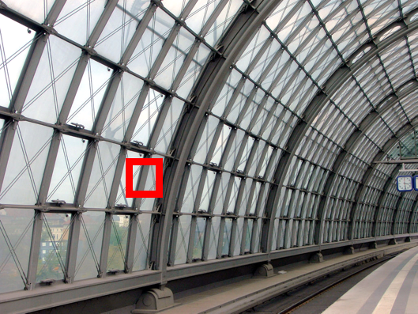         |          | 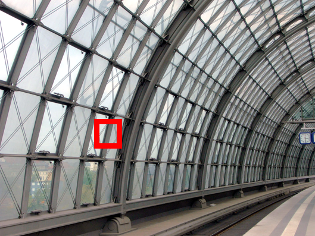      |           |
| 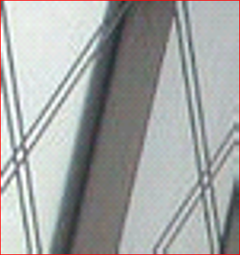 | 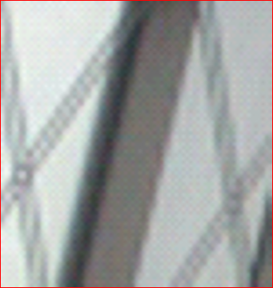 |  | 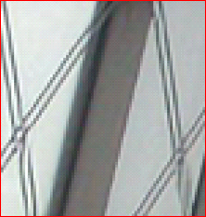 |

------

## Difference with Authors Implementation

Image Size

Epochs and Learning rate decay step

asdf

------

## Usage

> **On Windows**
>
> - run.bat
>
> **On Linux** 
>
> - run.sh

### Training Command

Examples in scale 2

- in run.bat/sh

  - Pre-training

    python main.py --model_name=idn_pre_x2 --is_train=True --scale=2 --pretrain=False --epochs=100 --data_path=data/train_data/idn_train_x2.h5

    

  - Fine Tuning

    python main.py --model_name=idn_x2 --is_train=True --scale=2 --pretrain=True --pretrained_model_name=idn_pre_x2 --learning_rate_decay=True --decay_step=250 --epochs=600 --data_path=data/train_data/idn_fine_tuning_x2.h5 

If you want to change other parameters for training, please see the file

> IDN-TensorFlow/model/configurations.py 

### Testing Command

Examples in scale 2

in run.bat/sh

python main.py --model_name=idn_pre_x2 --is_train=False --scale=2

### Trained checkpoint in experiments

- asdf

### Training dataset

- asdf

------

math equations are converted with [upmath.me](https://upmath.me)

